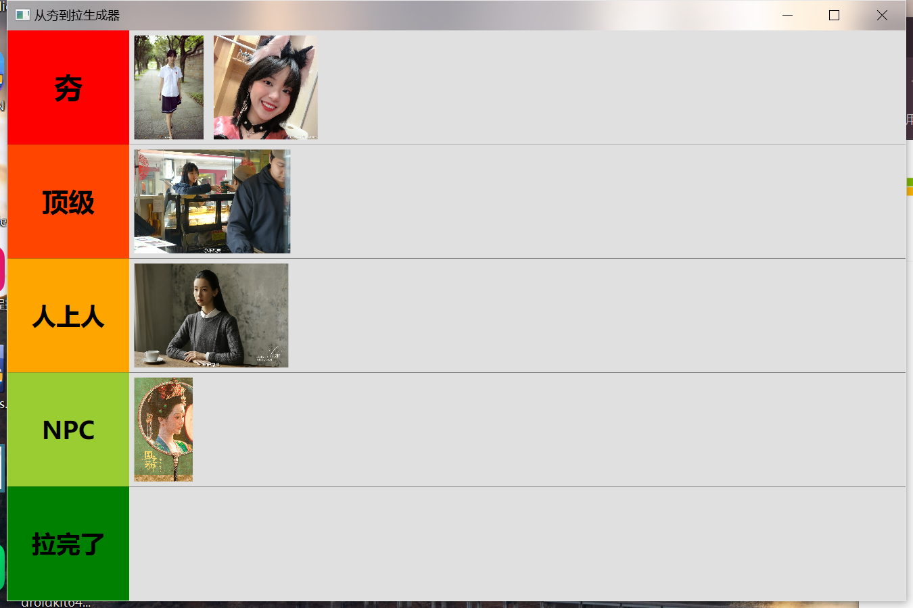

# 从夯到拉生成器 (Tier List Generator)

这是一个基于 C# 和 WPF 构建的轻量级桌面应用程序，旨在帮助用户通过极其简单的操作，快速生成属于自己的梯度排行榜（Tier List）。

## 📸 应用截图

## ✨ 功能特性

* **经典梯度预设**：内置五个特色梯度行——“夯”（红色）、“顶级”（橙红）、“人上人”（橙色）、“NPC”（黄绿）以及“拉完了”（绿色），色彩鲜明，直观易懂。
* **丝滑拖拽体验**：完全支持 Drag & Drop。你可以从 Windows 资源管理器中框选单张或多张图片，直接拖入对应的灰色区域。
* **动态自适应布局**：图片拖入后会根据当前行的高度自动缩放。当拉伸或缩小程序窗口时，所有图片都会实时、平滑地自适应调整大小，始终保持整洁的网格排列，不会撑爆界面。
* **常见格式支持**：支持拖入 `.png`, `.jpg`, `.jpeg`, `.bmp`, `.webp` 等常见图像格式。

## 🛠️ 技术栈

* **开发框架**: .NET WPF (Windows Presentation Foundation)
* **编程语言**: C#
* **UI 布局**: XAML

## 🚀 快速运行

1.  确保你的电脑上已安装 **Visual Studio**（推荐 2019 或更高版本）以及 **.NET 桌面开发工作负载**。
2.  克隆或下载本项目的源代码到本地。
3.  双击打开目录下的 `.sln` 解决方案文件。
4.  在 Visual Studio 中，按下 `F5` 键或点击顶部的“启动”按钮编译并运行程序。
5.  准备好你的图片素材，拖拽进界面右侧的灰色区域即可开始制作你的排行榜！
